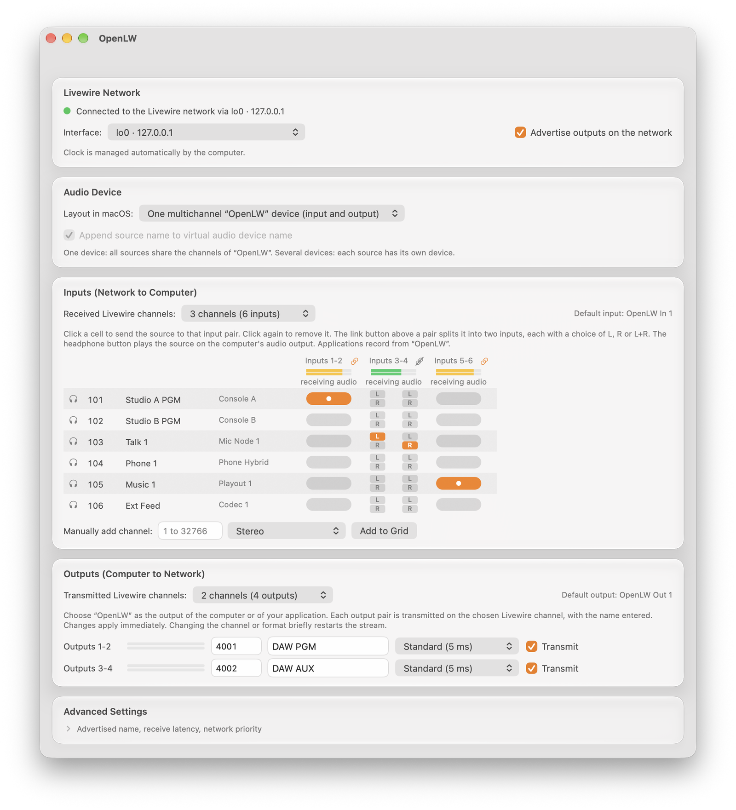

# OpenLW

OpenLW is an open-source audio driver for Livewire®-compatible and AES67 audio-over-IP networks. It connects desktop audio applications to network sources and destinations through a virtual audio device, source discovery, and an input/output patch matrix.

> [!WARNING]
> **Provided “as is” and probably not suited for production environments.** OpenLW is an independent, experimental project that has not been tested or certified for critical environments or any use where an interruption, delay or corruption of audio could cause harm or loss. It is provided “as is”, without warranty of any kind, express or implied, as stated in sections 7 and 8 of the [Apache License 2.0](LICENSE) (sections 15 and 16 of the GPLv3 for the Windows ASIO driver). Use it at your own risk.


## Features

- **Virtual audio device:** one multichannel “OpenLW” device (1–16 stereo channels in each direction), or on macOS and Linux numbered devices “OpenLW In n” and “OpenLW Out n”, one per source, named after it.
- **Receive:** discover advertised network sources, patch a Livewire channel to an input pair or, in mono (left, right, or L+R), to a single input, and preview sources through the Mac's audio output.
- **Transmit:** send each output pair on the selected Livewire channel, using the selected source name, and advertise it to other devices.
- **Network selection:** automatically use the interface receiving Livewire advertisements; apply changes without interrupting unrelated streams.
- **OpenLW app:** manage patches, transmission, meters, settings, and uninstallation.

<p align="center">
  <picture>
    <source media="(prefers-color-scheme: dark)" srcset="docs/assets/openlw-macos-dark.png">
    
  </picture>
</p>

| Platform | Architectures | Audio device | App | Status |
|---|---|---|---|---|
| macOS | Apple Silicon (macOS 11 and later), Intel (macOS 10.13 and later): one package each | CoreAudio (all applications) | OpenLW (AppKit, Liquid Glass on macOS 26) | Available |
| Windows 10 22H2 and 11 | x64, ARM64 | ASIO® driver, displayed as “OpenLW” (ASIO-compatible applications)  | OpenLW (WinUI 3) | Build from source only, no binary release ([why](#windows-build-from-source-only)) |
| Linux (PipeWire 0.3.49+) | x86_64, ARM64 | PipeWire nodes (PipeWire, PulseAudio, and JACK applications) | OpenLW (GTK4) | In progress; service, PipeWire nodes, app and packages implemented, real machine validation pending |

See the [Windows guide](windows/README.md) and [Linux guide](linux/README.md) for platform-specific progress and validation limits. The following usage instructions describe macOS.

## Install and start on macOS

Open the package for your Mac, `OpenLW-<version>-arm64.pkg` (Apple Silicon, macOS 11 or later) or `OpenLW-<version>-x86_64.pkg` (Intel, macOS 10.13 or later), and follow the installer. A package refuses to install on the other architecture. Then:

1. Connect the Mac to the Livewire network.
2. Open **OpenLW** from Applications.
3. To transmit, select “OpenLW” as the Mac's or application's output, enter the destination channel in OpenLW, and select **Transmit**.
4. To record, click the source's cell in the input matrix, then record from “OpenLW” in your audio application.

To uninstall, choose **OpenLW > Uninstall OpenLW…**.

Released packages are signed with a Developer ID and notarized by Apple. A package built from source without signing identities is unsigned: macOS then asks for confirmation when opening it (right-click > Open, or System Settings > Privacy & Security).

## Windows: build from source only

On Windows, OpenLW only provides an ASIO® driver. A WaveRT audio driver, which would make the device appear in Windows and in all applications as an “audio output” or “audio input”, only installs normally once signed through Microsoft: this requires an expensive EV code signing certificate and attestation signing for every release. The alternative, enabling test mode or disabling driver signature enforcement, is strongly discouraged. I don't plan to buy such a certificate for this project anytime soon.

Also, I highly encourage you to buy the Telos Alliance Windows driver for Livewire networks (Axia IP-Audio Driver).

The Windows service, ASIO driver, app and MSI installer must be built from source ([Windows guide](windows/README.md)); no Windows binary or installer will be released. Locally built installers are unsigned (no Authenticode signature): SmartScreen warns, and Smart App Control, when enabled, may block them.

## Build from source

The network service requires Rust 1.82 or later and a C compiler (Clang, GCC, or MSVC).

```sh
(cd daemon && cargo build --release)    # daemon/target/release/lw-daemon
```

For macOS, install Xcode with the macOS 26 SDK or later and the Rust targets `x86_64-apple-darwin` and `aarch64-apple-darwin`.

```sh
macos/scripts/build-all.sh          # Universal service, plugin, and app binaries
macos/installer/build-pkg.sh arm64  # build/OpenLW-<version>-arm64.pkg (Apple Silicon)
macos/installer/build-pkg.sh x86_64 # build/OpenLW-<version>-x86_64.pkg (Intel)
```

Platform and component guides:

- [Network service and configuration](daemon/README.md)
- [macOS audio plugin](macos/plugin/README.md), [app](macos/app/README.md), and [installer](macos/installer/README.md)
- [Windows](windows/README.md) and [Windows audio driver](windows/driver/README.md)
- [Linux](linux/README.md)

## Validate changes

```sh
(cd daemon && cargo test && cargo clippy --all-targets)
make -C macos/plugin test
python3 -m pytest -q tools/lw/tests
tools/ci/test-wine.sh               # Windows build under Wine (Docker)
```

[CI](.github/workflows/ci.yml) tests the daemon on macOS, Linux, and Windows, on x86_64 and ARM64. Container and Wine results do not replace validation on target systems. When contributing, use English for documentation and code comments, and keep observed behavior, implementation choices, and unverified assumptions distinct.

## Repository layout

| Directory | Contents |
|---|---|
| `daemon/` | Cross-platform Rust network service: RTP, advertisements, discovery, patching, and control channel |
| `macos/plugin/` | CoreAudio AudioServerPlugIn in C: the virtual audio device |
| `macos/app/` | OpenLW app in Swift and AppKit |
| `macos/installer/` | macOS `.pkg` installer |
| `windows/` | Windows service, audio driver, app, and installer (in progress) |
| `linux/` | Linux systemd unit, GTK app, and `.deb`/`.rpm` packages |
| `docs/protocol/` | Network specification: what OpenLW sends and accepts |
| `tools/lw/` | Python codecs, test transmitters, and capture analysis tools |
| `tools/wireshark/` | Wireshark dissector |
| `tools/ci/` | Windows tests under Wine (Docker) |

## Limitations

- No network-clock synchronization yet (PTP or Livewire clock). Buffer slips compensate for clock drift, with occasional brief interruptions.
- Surround and AES67 have not been verified with third-party devices.
- macOS 10.13 has not been tested on a target machine.

## License and trademarks

OpenLW is licensed under Apache License 2.0, except for the Windows audio driver, which is licensed under GPLv3 and built with Steinberg's ASIO SDK. See [LICENSE](LICENSE), [NOTICE](NOTICE), and the [driver license](windows/driver/LICENSE).

Livewire, Livewire+, and Axia are trademarks of TLS Corp. (Telos Alliance). OpenLW is an independent project, neither affiliated with nor endorsed by TLS Corp.; these names indicate compatibility only. OpenLW contains no TLS Corp. code, binaries, or documents.

ASIO is a registered trademark of Steinberg Media Technologies GmbH.
